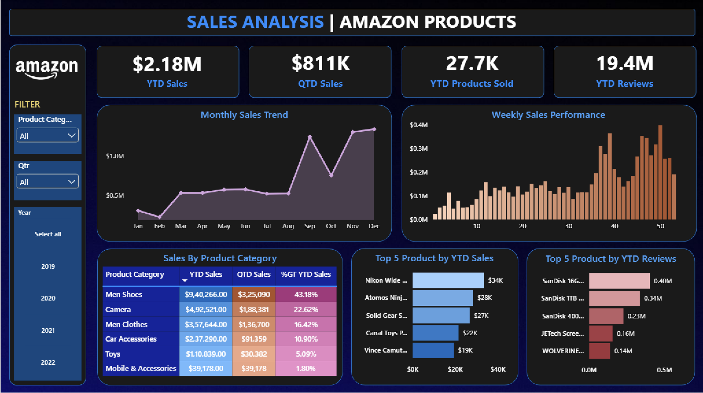

# Amazon Product Sales Analysis | Power BI

<p align="center">


</p>

<p align="center">
An interactive <strong>Power BI dashboard</strong> that analyses Amazon product sales from <strong>2019–2022</strong>, providing insights into sales trends, category performance, quarterly growth, and top-performing products.
</p>

---

## Table of Contents

- [Dashboard Preview](#dashboard-preview)
- [How to Use the Dashboard](#how-to-use-the-dashboard)
- [Overview](#overview)
- [Business Problem](#business-problem)
- [Dashboard Features](#dashboard-features)
- [Data Preparation](#data-preparation)
- [Data Model](#data-model)
- [DAX Measures](#dax-measures)
- [Date Table Columns](#date-table-columns)
- [Skills Demonstrated](#skills-demonstrated)
- [Key Insights](#key-insights)
- [Business Recommendations](#business-recommendations)
- [Important Data Limitations](#important-data-limitations)
- [Tools Used](#tools-used)
- [Repository Structure](#repository-structure)
- [Author](#author)

---

# Dashboard Preview

<p align="center">
  
</p>

---

# How to Use the Dashboard

1. Download the **Amazon Sales Analysis.pbix** file.
2. Open it using **Microsoft Power BI Desktop**.
3. Use the slicers to filter by:
   - Product Category
   - Quarter
   - Year
4. Hover over visuals to view detailed values.
5. Click any chart or visual to cross-filter the dashboard.
6. Clear filters to return to the default dashboard view.

---

# Overview

This Power BI portfolio project analyses Amazon product sales performance from **2019 to 2022**.

The dashboard provides an interactive view of:

- Sales trends
- Quarterly performance
- Product-record volume
- Aggregated review counts
- Category contribution
- Top-performing products by sales and reviews

---

# Business Problem

A retail team needs a concise way to monitor sales performance over time, identify high-performing product categories, and discover products that generate the highest sales and review activity.

This dashboard answers:

- How are sales performing Year-to-Date (YTD) and Quarter-to-Date (QTD)?
- Which months and weeks generate stronger sales?
- Which product categories contribute the most revenue?
- Which products generate the highest YTD sales?
- Which products have the highest aggregated review counts?
- How does performance change when users filter by Product Category, Quarter, or Year?

---

# Dashboard Features

- Interactive one-page Sales Overview dashboard
- KPI Cards
  - YTD Sales
  - QTD Sales
  - YTD Product Records
  - Aggregated Review Count
- Monthly Sales Trend (Area Chart)
- Weekly Sales Performance (Column Chart)
- Product Category Matrix
  - YTD Sales
  - QTD Sales
  - YTD Sales % of Grand Total
- Top 5 Products by YTD Sales
- Top 5 Products by YTD Reviews
- Interactive slicers for:
  - Product Category
  - Quarter
  - Year

---

# Data Preparation

Power Query was used to:

- Remove duplicate and blank rows
- Validate and assign appropriate data types
- Convert **Order Date** to Date format
- Preserve Price and Review Count as numeric fields
- Prepare the dataset for time-intelligence analysis

---

# Data Model

The model contains two tables:

- **Amazon_Data**
- **Date Table**

Relationship:

```text
Amazon_Data[Order Date]
            │
            ▼
Date Table[Date]
```

The Date Table was dynamically created using the minimum and maximum order dates from the dataset to support Power BI time-intelligence calculations.

---

# DAX Measures

```DAX
QTD Sales =
TOTALQTD (
    SUM ( Amazon_Data[Price(Dollar)] ),
    'Date Table'[Date]
)

YTD Sales =
TOTALYTD (
    SUM ( Amazon_Data[Price(Dollar)] ),
    'Date Table'[Date]
)

YTD Products Sold =
TOTALYTD (
    COUNT ( Amazon_Data[Product Category] ),
    'Date Table'[Date]
)

YTD Reviews =
TOTALYTD (
    SUM ( Amazon_Data[Number of reviews] ),
    'Date Table'[Date]
)
```

---

# Date Table Columns

- Month Name
- Year
- Month Name Sort
- Week
- Quarter Number
- Quarter Label (`Qtr`)

> **Note:** `Month Name Sort` is used to display month names in chronological order instead of alphabetical order.

---

# Skills Demonstrated

- Data Cleaning with Power Query
- Data Modeling
- DAX Time Intelligence (YTD & QTD)
- KPI Development
- Interactive Dashboard Design
- Business Data Visualisation
- Business Insight Generation

---

# Key Insights

| Year | YTD Sales | QTD Sales | Product Records | Aggregated Reviews |
|------|----------:|----------:|---------------:|------------------:|
| 2019 | $1.52M | $598K | 18.5K | 7.2M |
| 2020 | $3.10M | $1.44M | 19.2K | 9.7M |
| 2021 | $1.63M | $557K | 23.7K | 22.2M |
| 2022 | $2.18M | $811K | 27.7K | 19.4M |

### Highlights

- **2020** recorded the highest annual sales at **$3.10M**, representing approximately **104% growth** over 2019.
- Sales declined by approximately **47%** in **2021**, before recovering by approximately **34%** in **2022**.
- During **2020**, **Q4 contributed approximately 46.5%** of annual sales, indicating strong year-end seasonality.
- **Camera** led sales in **2019** and **2020**, while **Men Shoes** became the leading category in **2021** and **2022**.
- In **2022**, **Men Shoes** generated **$940.27K**, contributing **43.18%** of total YTD Sales.
- Interactive filters enable users to analyse trends by Year, Quarter, and Product Category.

---

# Business Recommendations

- Plan inventory and marketing campaigns ahead of stronger late-year sales periods, especially **Q4**.
- Prioritise investment in consistently high-performing product categories.
- Investigate the significant sales decline in **2021** to identify pricing, category, or seasonal factors.
- Use top-performing product insights to improve promotions and inventory planning.
- Review lower-performing categories before allocating additional marketing budget.
- Enhance future versions by incorporating:
  - Quantity Sold
  - Order ID
  - Profit Margin
  - Discount
  - Return Data

---

# Important Data Limitations

- **YTD Products Sold** is calculated by counting non-blank Product Category records. It should be interpreted as a **product-record count**, not actual units sold.
- **YTD Reviews** is the sum of the available review-count field and should not be interpreted as the number of new customer reviews received during the year.
- The dataset does not include:
  - Order IDs
  - Unit Quantity
  - Profit Margin
  - Discounts
  - Customer Information
  - Return Data
- This dashboard focuses on descriptive analytics and does not include forecasting or predictive modelling.

---

# Tools Used

- Microsoft Power BI
- Power Query
- DAX
- Data Modeling
- Interactive Data Visualisation

---

# Repository Structure

```text
Amazon-Product-Sales-Analysis/
│
├── data/
│   └── Amazon_Combined_Data.xlsx
│
├── screenshots/
│   └── sales-analysis-dashboard.png
│
├── Amazon Sales Analysis.pbix
└── README.md
```

---

# Author

**Ashish Gautam**

Data Analyst | Power BI | Excel | SQL

Email: ashishgautam323@gmail.com

LinkedIn: https://www.linkedin.com/in/theashishgautam/
